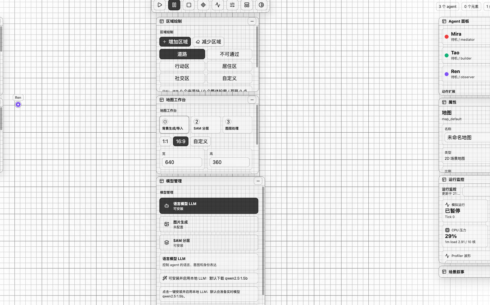

# Multi-Agent AI Game Engine

**语言 / Language:** **中文** | [English](README.en.md)

[](https://github.com/pijiuya/multi-agent-game-engine/releases/tag/v0.1.0)
[](LICENSE)
[](pyproject.toml)
[](frontend/package.json)

一个本地优先的多 Agent 场景模拟与可视化编辑器。它把 Python/FastAPI 模拟后端、React/Vite 透明工作台、Electron 桌面壳和本地模型工作流放在同一个项目里，用于构建地图、区域、物体、Agent 行动、LLM 决策事件和桌面交付包。



## 下载

当前公开版本：[`v0.1.0`](https://github.com/pijiuya/multi-agent-game-engine/releases/tag/v0.1.0)

- [Mac install kit](https://github.com/pijiuya/multi-agent-game-engine/releases/download/v0.1.0/Multi-Agent-Engine-0.1.0-mac-install-kit.zip)：包含 DMG、安装脚本、Ollama 辅助脚本、用户手册和 SHA256 校验文件。
- [Mac arm64 DMG](https://github.com/pijiuya/multi-agent-game-engine/releases/download/v0.1.0/Multi-Agent.Engine-0.1.0-mac-arm64.dmg)：单独应用安装镜像。
- [Windows x64 installer](https://github.com/pijiuya/multi-agent-game-engine/releases/download/v0.1.0/Multi-Agent.Engine-0.1.0-win-installer-x64.exe)：Windows 安装包。

安装包通过 GitHub Releases 分发，不提交进源码仓库。

## 核心能力

- **透明 2D 工作台**：导入或生成地图，绘制道路、障碍、行动区、居住区、社交区等区域。
- **多 Agent 模拟**：管理 agent、item、区域轮廓，驱动移动、停止、社交、发言、拾取和移动可交互物体。
- **LLM 决策事件**：记录普通 world events 和 `decision_events`，追踪“哪个 agent 的哪个模型做了什么决策”。
- **素材与动画**：给 agent 绑定 GIF 或 PNG 序列帧动画，并配置序列 FPS、最大像素数和显示缩放。
- **本地模型能力**：管理 Ollama LLM、图像识别、图像生成配置和内置 MobileSAM 分层。
- **桌面交付**：同一套前端可运行在浏览器和 Electron，支持 Mac / Windows 打包链路。

## 适合谁使用

- **独立游戏和模拟开发者**：快速搭建可观察的 NPC / agent 场景原型。
- **AI Agent 原型开发者**：验证多 Agent 行动、对话、物体互动和 LLM 决策链。
- **本地模型实验者**：把 Ollama、本地视觉模型和地图分层接入同一套工作流。
- **桌面工具交付测试者**：研究 Electron + Python 后端 + 本地 runtime 的安装包交付方式。

## 用户数据和本地优先

项目默认把运行数据保存在仓库根目录的 `runtime_project/`，该目录被 `.gitignore` 排除，不会提交到 Git。

`runtime_project/` 通常包含：

- `world.sqlite`：地图、agent、item、事件、decision events、模型配置等主要状态。
- `project.json`：项目元数据。
- `assets/`：上传的地图背景、item 图片、agent GIF/PNG 序列帧。
- `models/`：内置 MobileSAM 等本地缓存模型。

迁移到另一台机器时，可以只 clone 源码生成空白项目，也可以额外复制 `runtime_project/` 保留当前场景。

## 技术栈

- Backend: Python 3.11, FastAPI, Uvicorn, Pydantic, Shapely, SQLite
- Frontend: React 18, TypeScript, Vite, Three.js, Pixi.js, Lucide icons
- Desktop: Electron
- Tests: Pytest, Playwright
- Local models: Ollama, embedded MobileSAM

## 快速启动

### 后端

```bash
python3.11 -m venv .venv
source .venv/bin/activate
python -m pip install --upgrade pip
python -m pip install -e ".[dev]"
AGENT_ENGINE_PROJECT_DIR=runtime_project python -m uvicorn agent_engine.api.main:app --app-dir backend --host 127.0.0.1 --port 8000
```

Windows PowerShell:

```powershell
py -3.11 -m venv .venv
.\.venv\Scripts\Activate.ps1
python -m pip install --upgrade pip
python -m pip install -e ".[dev]"
$env:AGENT_ENGINE_PROJECT_DIR = "runtime_project"
py -3.11 -m uvicorn agent_engine.api.main:app --app-dir backend --host 127.0.0.1 --port 8000
```

### 前端

```bash
cd frontend
npm install
npm run dev -- --port 5173
```

打开 `http://127.0.0.1:5173/`。

### Electron 桌面版

```bash
cd frontend
npm run electron:dev
```

## 常用命令

```bash
# 后端测试
.venv/bin/python -m pytest -q

# 前端类型检查和生产构建
npm --prefix frontend run build

# 前端 Playwright 回归
npm --prefix frontend run test:e2e
```

## 版本管理

- 当前版本：`v0.1.0`
- Python 包版本来自 [`pyproject.toml`](pyproject.toml)。
- 前端 / Electron 版本来自 [`frontend/package.json`](frontend/package.json)。
- Release tag 使用 `vX.Y.Z` 格式。
- 版本变更记录见 [`CHANGELOG.md`](CHANGELOG.md)。

## 文档

- [用户手册](docs/user-manual.zh-CN.md)
- [开发手册](docs/development-manual.zh-CN.md)
- [Mac 安装说明](docs/mac-installation.zh-CN.md)
- [Windows 安装说明](docs/windows-installation.zh-CN.md)
- [Windows 打包说明](docs/windows-packaging.zh-CN.md)
- [动作扩展设计](docs/action-extension-manual.zh-CN.md)

## 目录结构

```text
.
├─ backend/agent_engine/        # 后端 API、规则、模拟、模型 provider、持久化
├─ frontend/src/                # React 编辑器、桌面工作台 UI、官方页面
├─ frontend/electron/           # Electron 主进程和 preload
├─ frontend/tests/              # Playwright 前端回归测试
├─ tests/                       # Pytest 后端测试
├─ docs/                        # 中文开发和功能手册
├─ packaging/                   # Mac / Windows 打包脚本
├─ runtime_project/             # 本机运行数据，默认不提交
├─ pyproject.toml               # Python 包和测试配置
└─ README.md
```

## 贡献

欢迎提交 issue 和 PR。请先阅读 [`CONTRIBUTING.md`](CONTRIBUTING.md)，并在 PR 中说明运行过的测试。

## 许可证

本项目使用 [MIT License](LICENSE)。
